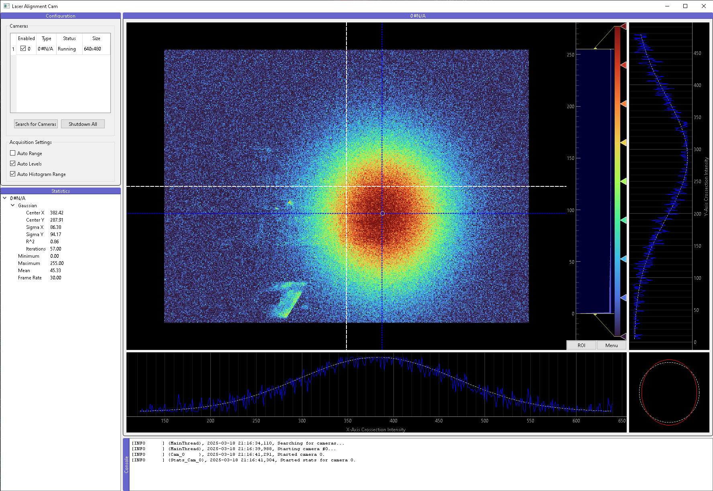

# Laser Alignment Camera Helper

This application captures images from USB cameras and performs statistical analysis to assist with laser alignment. It uses PyQt6 for GUI, pyqtgraph for data visualization, and scipy and lmfit for statistical analysis.



### Python Environment

This project relies on the following Python packages:

- **debugpy     ~=1.8.0**: A debugger for Python that works in Visual Studio Code and other editors supporting the Debug Adapter Protocol.
- **lmfit       ~=1.3.2**: A library for non-linear least squares minimization.
- **numpy       ~=1.26.1**: A fundamental package for scientific computing with Python.
- **opencv_python~=4.8.1.78**: OpenCV (Open Source Computer Vision Library)
- **PyQt6       ~=6.4.2**: A set of Python bindings for The Qt Company's Qt application framework.
- **PyQt6_sip   ~=13.10.0**: The SIP module required by PyQt6.
- **pyqtgraph   ~=0.13.7**: A pure-Python graphics and GUI library built on PyQt/PySide and NumPy.
- **scipy       ~=1.11.4**: A Python-based ecosystem of open-source software for mathematics, science, and engineering.

### Installing Dependencies

You can install all the required dependencies by running:

```sh
pip install -r requirements.txt
```


## Files

- `main.py`: The main entry point of the application.
- `camera.py`: Contains the `USB_Camera` class for capturing images from a USB camera, as well as the `Camera_Stats` class for performing statistical analysis on the captured frames.
- `util.py`: Contains utility functions for managing logging, Qt signals and threads.


## Usage

To run the application, execute the `main.py` file using Python:

```bash
python main.py